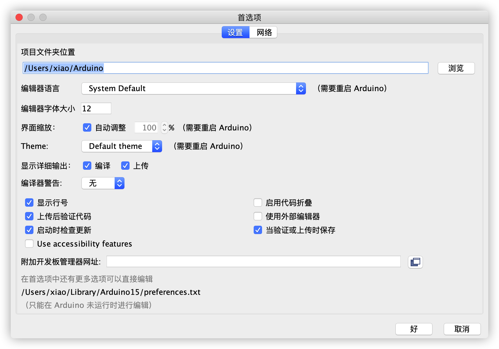
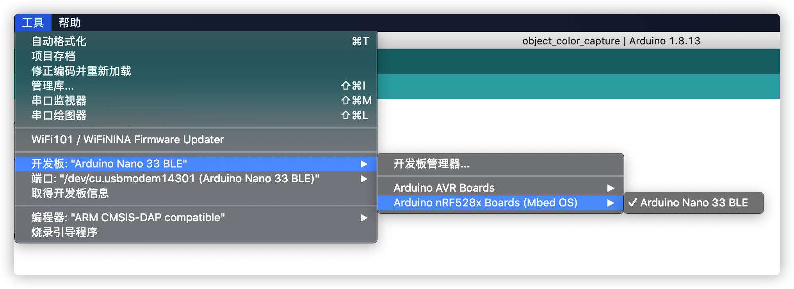
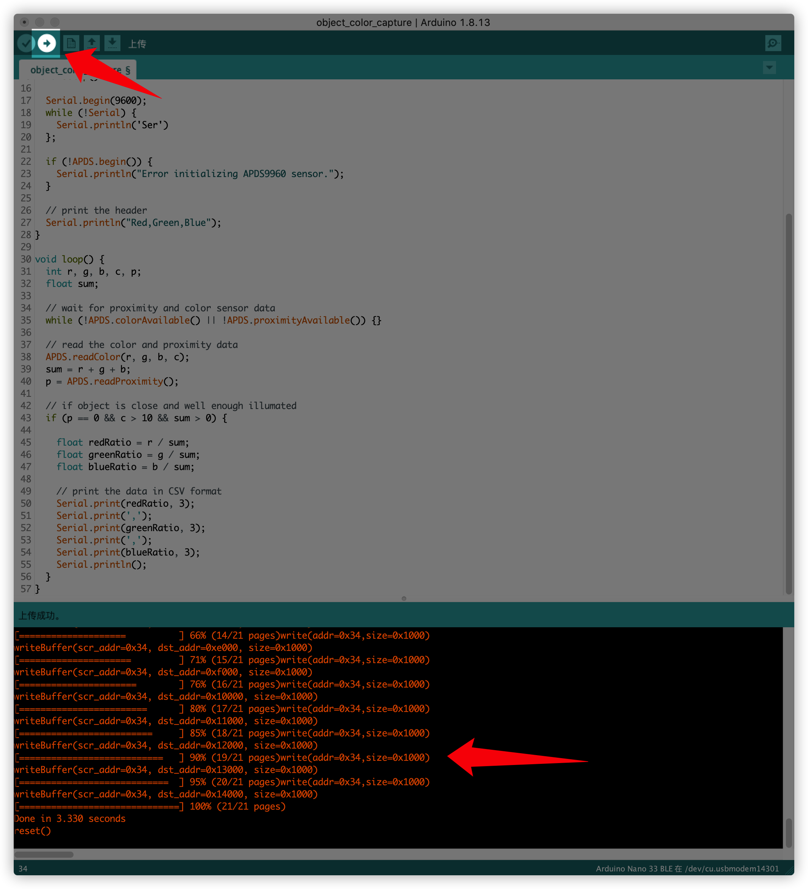
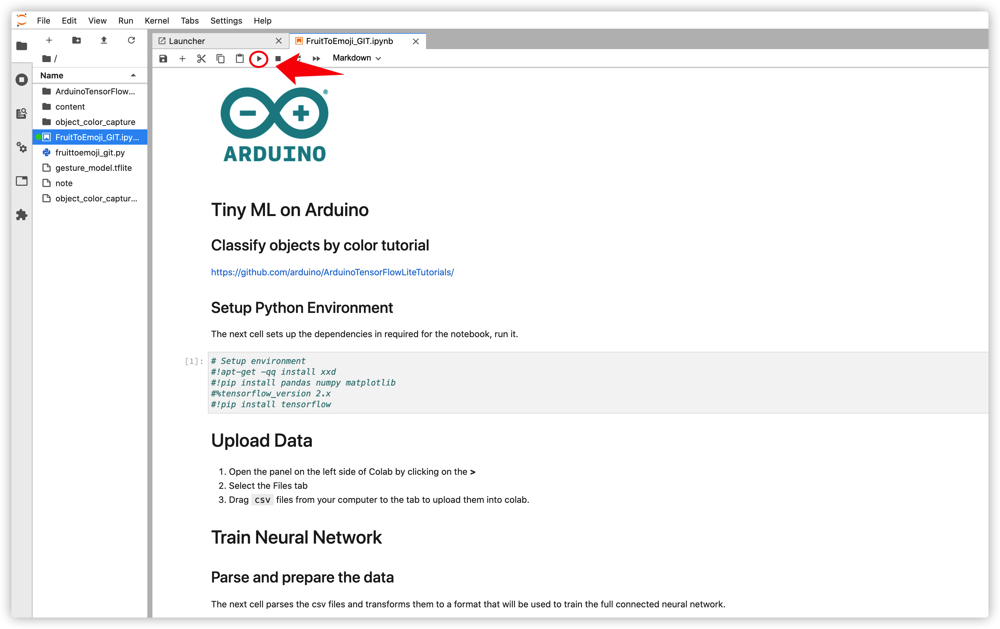
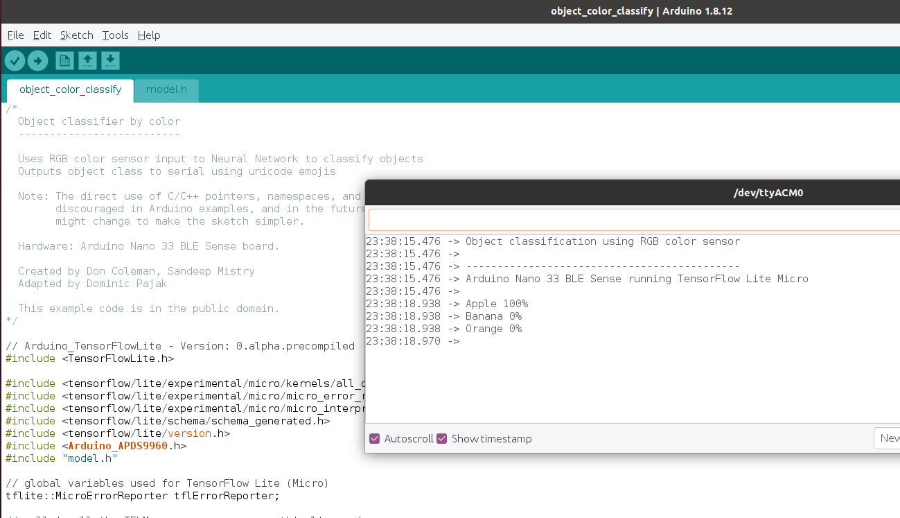
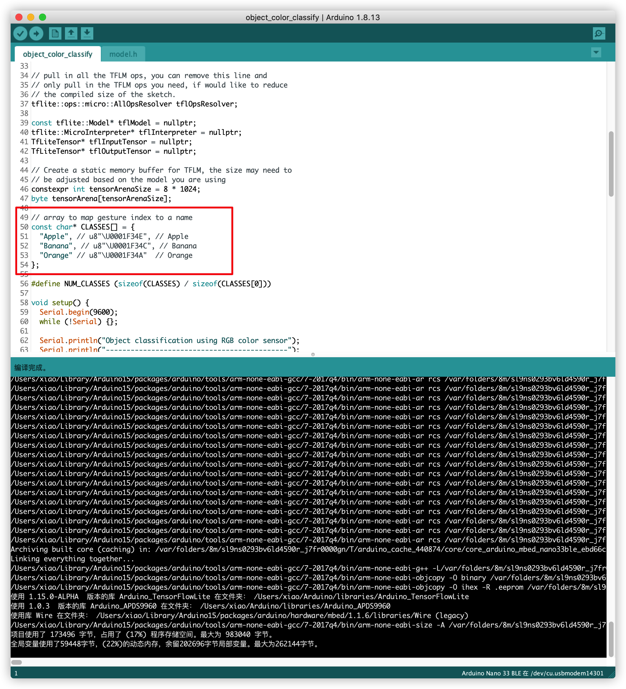

# AI CodeLab 全程回顾

> 本篇文章是 DGD DevFest 2020 AI 分会场全程回顾，本仓库作为归档。
>
> 此次分会场包含一场 CodeLab，与两位嘉宾录制了视频进行分享
>
> 查看视频嘉宾分享：链接: https://pan.baidu.com/s/1Odx5lvl655brENLDqlBGbA  密码: hpjf
>
> CodeLab 相关内容请继续往下。


## 环境搭建

可以使用多种方式来搭建环境

- 使用已经打包好的虚拟机

  链接: https://pan.baidu.com/s/1U66hUjrYkUFDQrlgXExWZg  密码: 5o05

- 如果你是Windows系统， 请按照以下方法搭建Linux环境：

  1. 下载并安装Virtualbox虚拟机及拓展包 ：

     VirtualBox:

      https://download.virtualbox.org/virtualbox/6.1.16/VirtualBox-6.1.16-140961-Win.exe

     拓展包：

     https://download.virtualbox.org/virtualbox/6.1.16/Oracle_VM_VirtualBox_Extension_Pack-6.1.16.vbox-extpack

     Ubuntu20.04 镜像：

     http://mirrors.aliyun.com/ubuntu-releases/20.04/ubuntu-20.04.1-desktop-amd64.iso

  2. 安装VirtualBox：

     打开下载好的VirtualBox安装文件，默认安装即可

  3. 安装扩展包：

     点击 VirtualBox菜单，管理->全局设定->扩展。 点击右边+，加载已下载的扩展包。

  4. 下载并用 VirtualBox 打开 Ubuntu 镜像，执行安装 

  5. 现在，您已经有一个Linux 环境了，请参阅下一节内容在Linux系统安装相应工具。 

- 如果使用linux系统，提前安装以下工具即可：

  - 下载安装 Arduino

    https://downloads.arduino.cc/arduino-1.8.13-linux64.tar.xz

    
    ```bash
    tar -Jxvf arduino-1.8.13-linux64.tar.xz && cd arduino-1.8.13 && sudo bash install.sh
    ```


  - 将本仓库下 `libraries` 内所有内容拷贝到 Arduino 默认的库路径下

    

    拷贝后路径为 `/Users/xxx/Arduino/libraries`
  
  - 安装 Python 相关库
  
    执行 `pip install tensorflow pandas matplotlib jupyterlab`


## 详细步骤

### 采集数据

1. 连接 sensor 板

   

   

2. 烧录程序

   打开 `demo/ArduinoTensorFlowLiteTutorials/FruitToEmoji/sketches/object_color_capture` 下的` object_color_capture.ino`

   > 烧录遇到问题请查阅文末 FQA 一节

   

3. 开始采集数据

   打开 串口监视器，让 sensor 板对准备识别的物体，开始采集数据。

   // 由于买的板子还没到，所以暂时不插入图片

4. 保存采集到的数据

   将采集到的数据拷贝到 `<物体名称>.csv`文件

### 训练模型

1. 进入目录 `demo`
2. 在当前目录下执行 `jupyterlab .` 点击 run 按钮执行所有代码
3. 
4. 经过上面步骤，最后将生成 `model.h` 的文件，这是识别物体的关键。

### 进行识别

进入路径 `demo/ArduinoTensorFlowLiteTutorials/FruitToEmoji/sketches/object_color_classify`  

使用Arduino 打开文件 `object_color_capture.ino`, 依照上面 ***烧录程序*** 一节将程序烧录到板子上，接下来即可开始识别。

开始正常的识别示例：




## FQA

1. **烧录程序设备断开或找不到设备，无法烧录进去怎么办？**

   在点击 Upload 后，连按两下 sensor 板的 reset按钮，看到橙色指示灯进入呼吸灯模式，此时板子处于烧录准备状态。顺利烧录后橙色指示灯开始闪烁表示程序已经烧录并开始执行。

2. **编译错误，寻到头文件失败怎么办？**

   这里出现的原因很可能是 TFlite 版本问题，打开 ***工具 ->管理库*** 查看 TFlite版本 

   

   

   按照上面截图安装 TensorFlowLite version 1.15版。precompiled和源码库都需要安装。因为arduino的invoke函会，会调用源码中的头文件内容。
   
3. **只能按照教程中的识别苹果，香蕉，橘子么？**

   不是，你可以准备自己想识别的物体，分别采集数据进行命名，接下来修改

   

   为你想要识别的物体即可。
